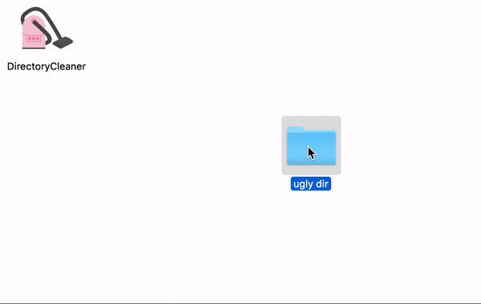

# DirectoryCleaner
> Easy drag and drop application for Mac OSX that sorts your files by extension.

## Build
> To build the application, run:

    python setup.py install
    ./build.sh

> This will create the app and put it in the `dist` directory.
